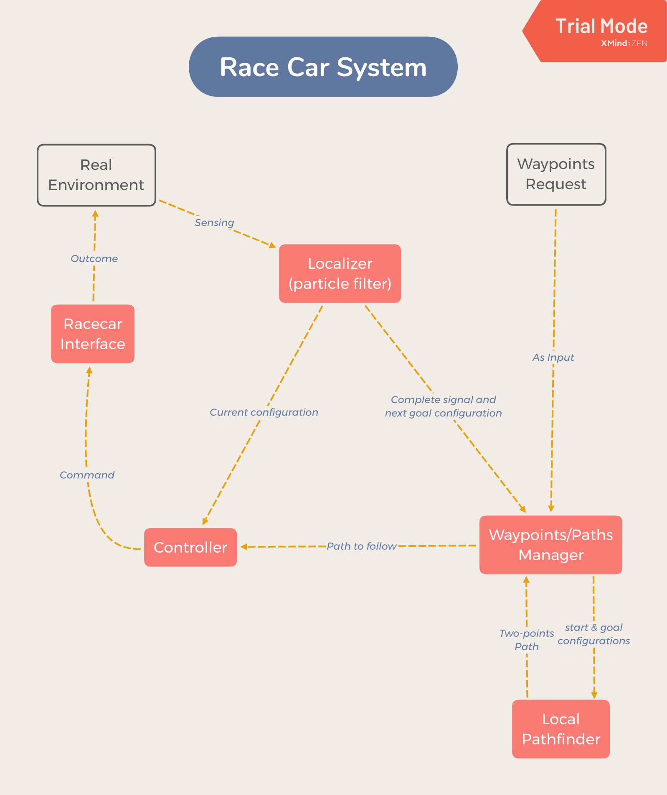
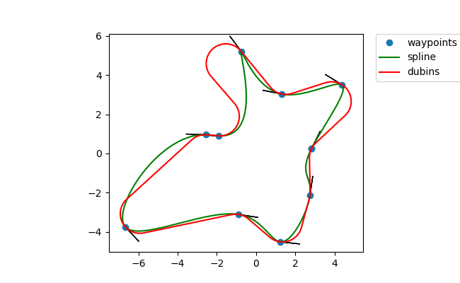

## CSE490 Final Project Writeup

[github repo](https://github.com/liruiw/490R_Projects)

#### High-level idea: 

##### Controller: 
We use Lyapunov controller to follow path because it turns out to be the most stable ones with minimum tuning. The drawback is that we have to leave all collision avoidance to planner.Often times, we noticed that racecar planning in simulation would work fine but would collide with the map environment, e.g. walls, forcing to manually tune input curvature for Dubins path planning.

##### Particle Filter: 

We turn off the kidnap and global localization feature at demo day.

##### PathManager & Local PathFinder:

We implemented two methods in total to accomplish the final project. The first method (refered as PathManagerNode) extends from our previous labs and 
works well in simulation for CSE 002, but after the demo map is released, we switched to a more specific strategy (refered as PlannerNode).

##### PathManagerNode:

We assumed that the map is not given until demo day, and construction for a dense graph could be time-consuming. Therefore, we decided to use Lazy A* and incremental densification for overall path planning. We used the [package]( https://github.com/AndrewWalker/Dubins-Curves )(which runs C in backend and a few orders of magnitude faster than the original script) for efficiently generating dubins path. Given this package, we can generate a graph of 1000 nodes with 1000 radius around 5 seconds. Note that for each sample position in our halton sequence, we sample 4 headings for robustness. This sparse graph would be used as a base graph to find a path between any pair of start and goal in the map. 

The PathManagerNode then takes in a request of waypoints (positions and scores), and outputs an ordered list of waypoints with their headings. Since we decided to traverse all the waypoints and time issue seems unrelated for demo, we decided to greedily traverse the waypoint (always find the closest next goal in terms of Euclidean distance).

Then, we use cubic spline to generate a smooth curve across waypoints, and take the tangent vectors as references for the headings at those waypoint positions. The dubins path can fits with the curve quite well, which we  consider a rough global reference path, if connecting waypoints in the order of traversal forms a convex polygon.

After it generates the order of traversal, it stores the waypoints in a queue, which continuously calls planner to generate path and updates the next path whenever the controller finishes following the current path. The strategy is that the controller thread follows the path to the first waypoint in the queue and planner thread continues to plan for the unfinished waypoints in parallel. Moreover, we can optionally set incremental densification to the planner, so that it is able to start with a sparse graph and optimize the path whenever there is time left. Compared with simple multi-goal strategy, this one maximizes the time usage and reaches very promising results.

(see `videos/final_real_cse022.mp4`).

##### PlannerNode:
The PathManagerNode turns out to generate very sharp turns and twisted path for when waypoints in the long narrow demo map are too close. Moreover, it is not easy to figure out the optimal headings for the waypoints in this map, because a bad heading is very likely to prevent the planner from finding a path. These two problems turned out critical and independent of the size of the graph and the other parameters of the controller and planner. Thus, we planned to follow the exact path backward after reaching a waypoint to avoid the difficulty of getting out of a dead path. Also, since the map is given, we decided to use such prior to write a more specific planner which explores the map in a main circular path (we set the waypoints manually) and heads to a waypoint within a threshold distance is is reachable with a single dubins path. Specifically, we inspected on the graph and chose to plan direct dubins path from start to goal with collision checking instead of running astar for shortest path in the graph. This simple approach turns out to work more robustly in simulation and in practice for this map. On demo day is that our particle filter turns out not very stable and although it successfully traverses all the waypoints in the rviz visualization, there is offset in real map. In addition, one problem for our controller is that it stops moving whenever collision happened, so our model is also very sensitive to the path found. We ended up having a full turn in the beginning and a few straight path that close to the wall, both of which made huge trouble. Since our final strategy is different for demo, see `videos/final_sim_cse691.mp4` for a simulation running in CSE691.

##### Results and modifications:  
Often times, we noticed that racecar planning in simulation would work fine but would collide with the map environment, e.g. walls, forcing to manually tune input curvature for Dubins path planning.