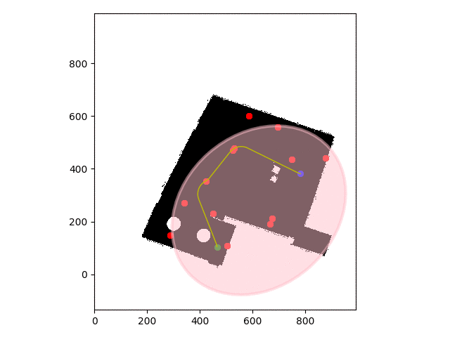

To run the planner with the robot in sim,
1. Start teleop.launch
2. Start map_server.launch
3. Start controller from lab2, e.g. pid_controller.launch
4. Launch rviz and add the map, /sim_car_pose/pose, /move_base_simple/goal, /controller/path/poses for visualization.
5. Run `python ROSPlanner.py`. It should construct a graph (or load an existing one from `ros_graph.pkl` if you already made one) and print "Ready to take goals".
6. Initialize the robot pose and goal pose. The planner should find a plan and send to the controller. It also saves plan in `plan.png`.

To run the planner with the robot in real, you need to run the particle filter.
1. Launch `ParticleFilter.launch`.
2. In your planner launch file, you should publish `pose_topic` as the topic published from particle filter, i.e. `/pf/viz/inferred_pose` so that `ROSPlanner.py` can take this as the robot's current pose.

Cool Demo of anytime planning!

