##   Lab 3 Writeup

### 2. A* algorithm

#### 2.1.1

Note: We are not using the default start and goal position, under which circumstance the differences between different $$\alpha$$ values do not contrast enough. Instead, we are running :


``` shell
python run.py -m ../maps/map2.txt -s 10 10 -g 350 350 –num-vertices 250
–connection-radius 100
```

|   $$\alpha$$   | 1 | 50 | 20 |
| :--: | :--: | :--: | :--: |
| Path length (pixel) | 547.54 | 583.50 | 571.71 |
| Planning time (s) | 0.00468 | 0.00198 | 0.00177 |

- When $ \alpha = 1 $, the heuristic estimation < true estimation,  the path length is optimal (it's obviously less than the path length when $\alpha = 20, 50$ ; however, the number of states that are explored are larger so the time spent on planning is more.
- When $\alpha = 20, 50$, $$\alpha h >h^*$$ , the heuristic is not admissible, so the path length is not guaranteed to be optimal. Meanwhile, a large $$ \alpha $$ trims down the planning time by only expanding nodes that fit the heuristic (in this case closer to the straight line between start and goal).
- $$\alpha=1$$:        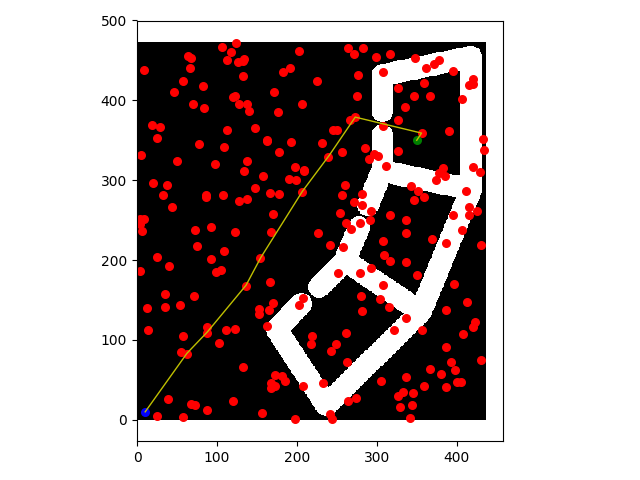
- $$\alpha = 20$$: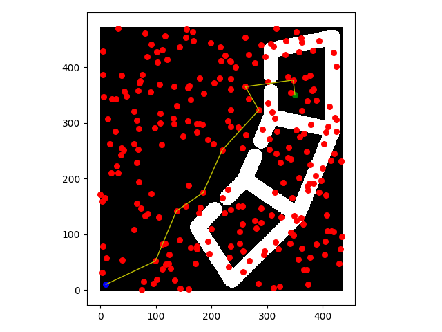
- $$\alpha=50$$: 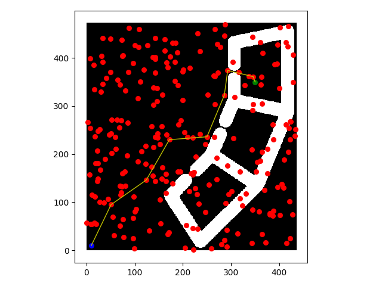

#### 2.1.2

|   number of vertice   | 250 | 500 |
| :--: | :--: | :--: |
| connection-radius (threshold) | 50 | 40 |

#### 2.1.3

|   connection radius   | 100 | 200 |
| :--: | :--: | :--: |
|        number of vertice (threshold)        | 200 | 90 |

Our conclusion for 2.1.2 and 2.1.3 is that the number of vertice and the connection radius have some inverse proportional relationship in planning success. Intuitively, more vertice and less radius should provide similar coverage  as less vertice and larger connection radius. Coverage is an important quality of the graph and directly affects the success of the planning. Although we are provided the optimal radius and vertice number in lecture, we end up not using those parameters because of the unknown constants.

3. Lazy A\*

- In our lab's implementation, $$A^*$$  will do edge checking when building the graph, while lazy $$A^*$$  only checks edge validity when searching the path.  Since Lazy $$A^*$$ graph connects edges in the graph even though they might have collision (compare fig 3 and fig 1), Lazy $$A^*$$ spend less time building the graph. Also, since Lazy $$A^*$$  will do edges checking when searching the path, the time spent on planning is more than $$A^*$$. From lecture, we know that lazy $$A^*$$ only check edge validity when it expands the edge, which minimizes the time spent on checking unnecessary expanded nodes. Therefore,  the total time of graph making and planning should be less than $$A^*$$ .

  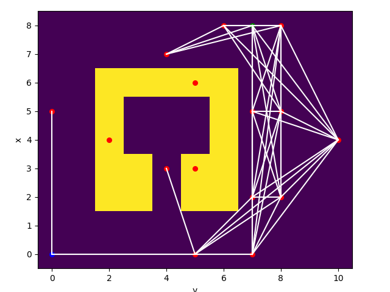

  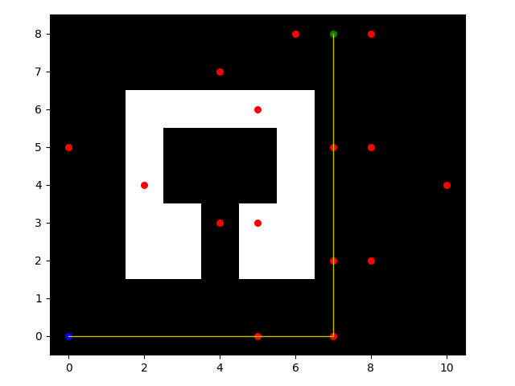

  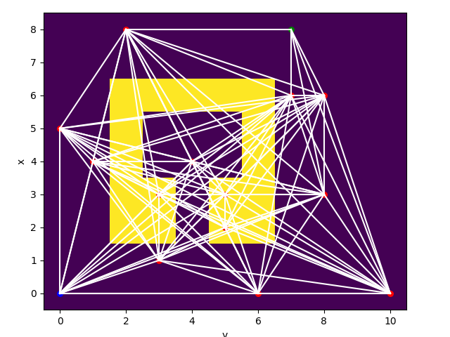

  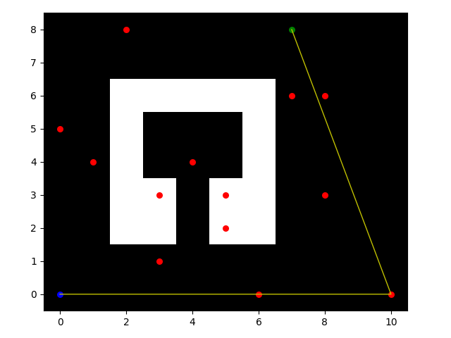

|      | A\* | Lazy A\* |
| :--: | :--: | :--: |
|        Graph construction time        |  1.395  | 0.584 |
| #Edges evaluated | 3807 | 157 |
| Planning time | 0.00614 | 0.0409 |
| Solution length | 559.91 | 559.231 |

The table above verifies the guess that we proposed previously, using the parameters below.

```shell
python run.py --map '../maps/map2.txt' -s 10 10 -g 350 350 --num-vertices 250 --connection-radius 100 ## --lazy
```

- A\*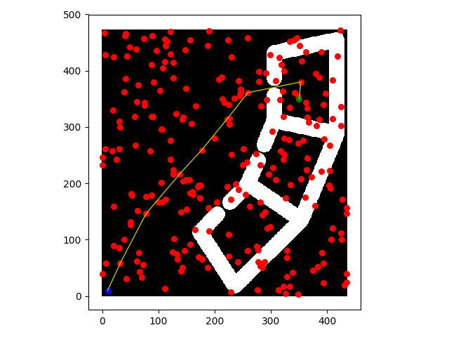

- lazy A\* 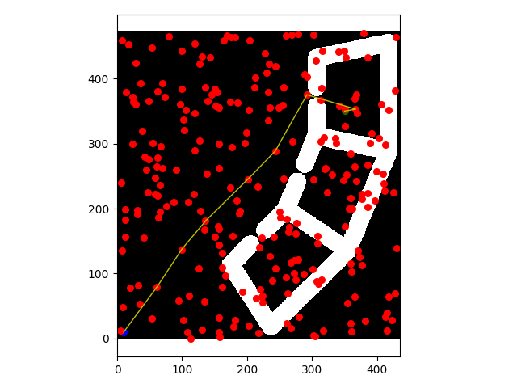

### 4. Dubins path

``` shell
python runDubins.py -m ../maps/map1.txt -c 0.5*3 -s 0 0 0 -g 8 7 90 --num-vertices 30
```

Note: We are using Halton Sequence Sampler for this part.

|  curvature  | 0.5*3 | 1.0*3 | 2.0*3 |
| :--: | :--: | :--: | :--: |
| path length | 12.522 | 17.306 | 16.951 |

For simulation, the range of steering angle is [-0.34, 0.34]. According to motion model of the Race Car,  the largest curvature is : $$\frac{1}{R} =\frac{\omega} {V} = \frac{tan(\delta)}{L} = \frac{tan(0.34)}{0.33} = 1.07 $$. However the radius of the smallest circle the real car can follow is $$\frac{1}{R} = \frac{1}{0.61}  = 1.64 \Rightarrow \delta = 0.496  $$, which is different from simulation.


| curvature = 1.5               |                                      |
| ----------------------------- | ------------------------------------ |
| 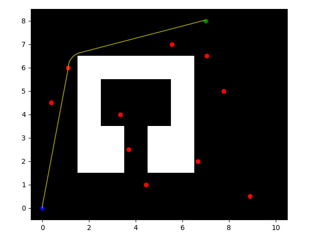 | 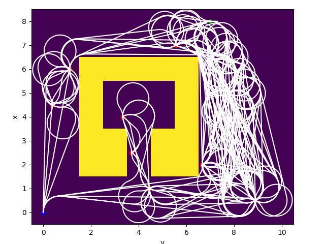 |


| curvature = 3.0              |                                     |
| ---------------------------- | ----------------------------------- |
| 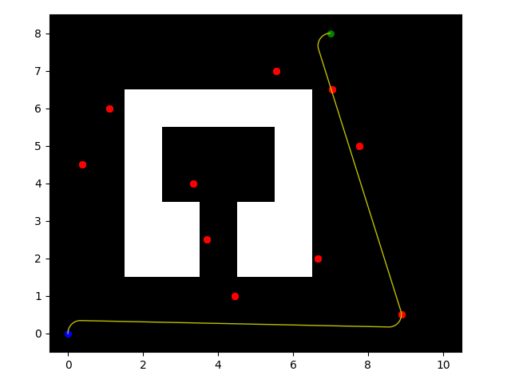 | 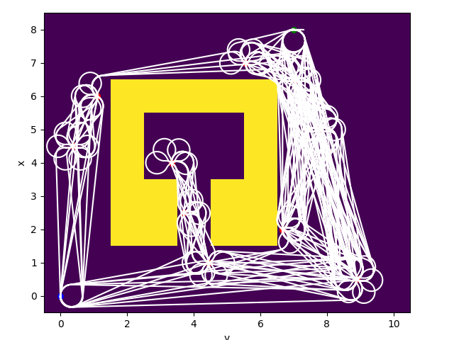 |


| curvature = 6.0              |                                     |
| ---------------------------- | ----------------------------------- |
| 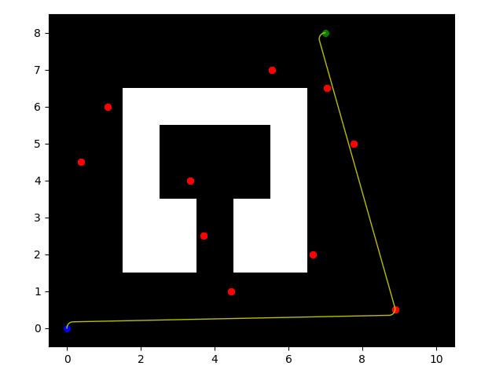 | 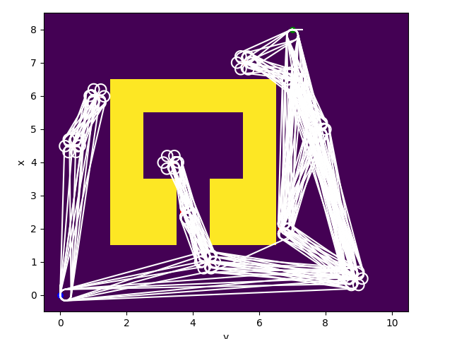 |


Discussion:  All three cases are using the same Halton Sequence Samples. The larger the curvature is, the sharper the turns are. Observe that when the curvature = 1.5, the turning radius is relatively larger than other two cases. Therefore, the car can find shortest path around the upper left corner of the obstacle without collision, which is not achievable by other two cases, where the paths between two points approximate straight lines.

### 5. Integration

The parameter that we're using:

``` python
ROSPlanner(heuristic, weight, num_vertices=250, connection_radius=1000, do_shortcut=True, num_goals=1,plan_time=2, plan_with_budget=False, curvature=0.018) # 250 500
```

|      | Lazy A\* + Dubins path |
| :--: | :--: |
|        Graph construction time        | 286.46(generate graph) +5.54(add start and goal to G) = 292.00 |
| \# of edges evaluated | 3 |
| Planning time | 1.042 |
| Solution length | 494.32 |

- car following planning path: 

### 6. Postprocessing a planned path


|         A\*         |        With shortcut        | Without shortcut |
| :-----------------: | :-------------------------: | :--------------: |
| Total Planning time | 0.00718 + 0.00255 = 0.00973 |     0.00732      |
|    Shortcut time    |           0.00255           |        \         |
|     Path length     |       532.15(4 nodes)       | 533.01 (9 nodes) |

- without shortcut: 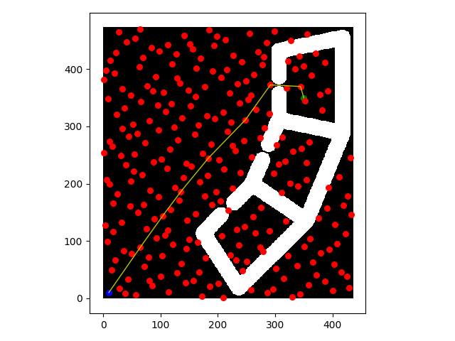
- with shortcut: 
- Screenshot of running a shortcut path on the cse022 map. (In fact, the path is not shortcut because it's already the optimal one)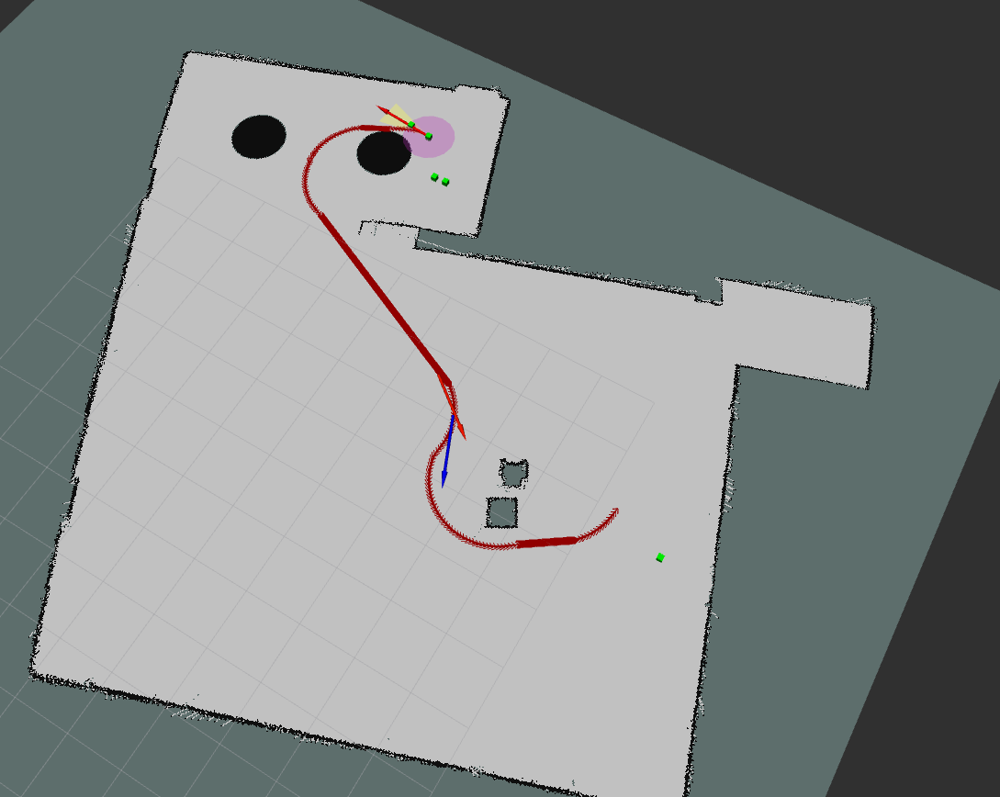

### 7. Extra Credit 1: Multiple goals

see `videos/multigoals.mp4` , `videos/multigoals_real.mp4`, `rosbag/multigoals.bag` and `rosbag/multigoals_real.bag`

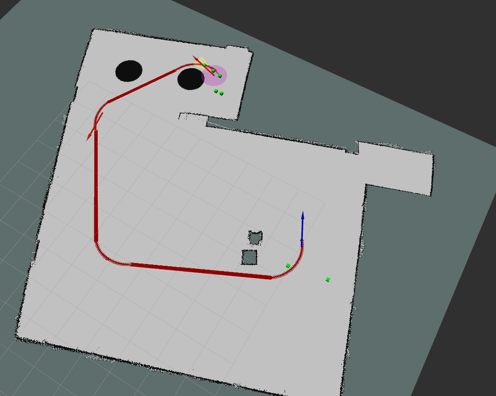


### 8. Extra Credit 2: Incremental Densification

In order to do anytime planning, we start with a sparse graph with nodes generated by the halton sequence, and a given time budget. We first make sure that there's a valid path found in the sparse graph. If there is still time left after the first plan with the sparse graph, we keep densifying the graph and replan, in the hope of finding a shorter path. The planning algorithm is a simplified version of informRRT. We construct a ellipse with the start and goal being the foci, euclidean distance as focal length (2c) and current minimum distance as the longer axis length (2a). Then, we uniformly sample from this region during each densification. In implementation, each time we add 4 nodes, each node we create three copies by perturbing its orientation from the start point's configuration. The result planning is shown below. The statistics for the cost of solution vs time and number of nodes vs time are attached. 


| Average path costs found with 0.3, 1, 2, 5, 10 seconds | Path costs found at each stage with 100s time budget (single trial) |
| ------------------------------------------------------ | ------------------------------------------------------------ |
| 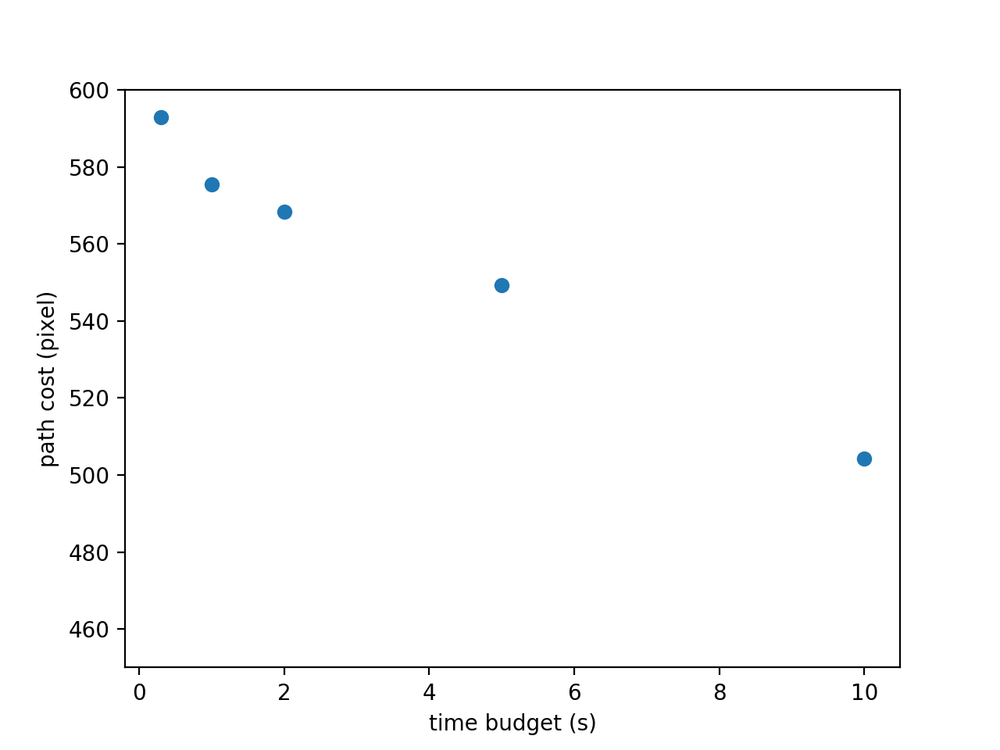                        | 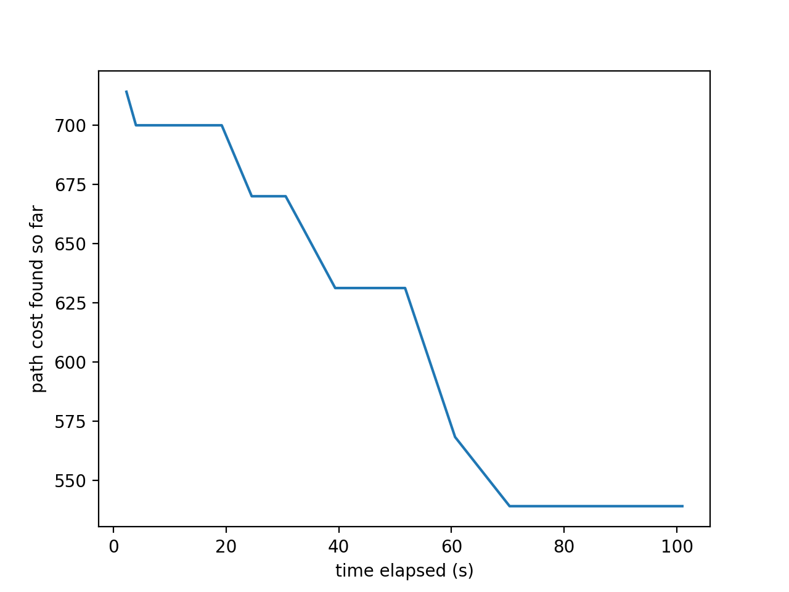                       |


The one-shot method takes around 70 seconds for generating the graph and 0.5 second for planning.  In comparison, we spend 3 seconds in building a 30 vertice, and 40 seconds to generate a solution with cost around 631 and 60 seconds for a cost 568 path. So, it's clear that the densification method drastically increases the efficiency of finding a optimal path and it can be stopped anytime and still have a valid path. Most of the time is spent on adding the nodes and also there's overhead in visualizing the path. Also note that there's randomness involved in the sampling process. (The gif is attached in /videos) 

