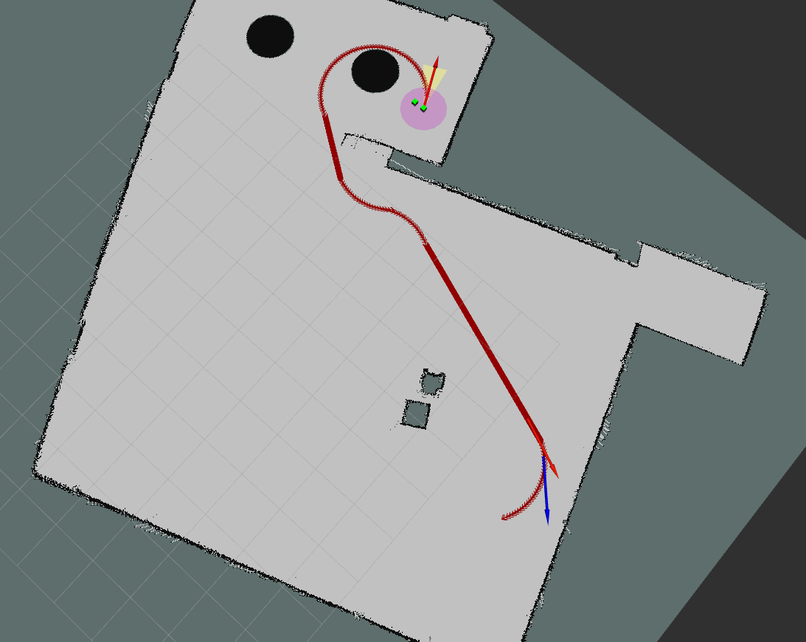

##   Lab 3 Writeup

### 2. A* algorithm

#### 2.1.1 

Note: We are not using the default start and goal position, under which circumstance the differences between different $\alpha$ values are not obvious. Instead, we are running :


``` shell
python run.py -m ../maps/map2.txt -s 10 10 -g 350 350 –num-vertices 250
–connection-radius 100
```

|   $\alpha$   | 1 | 50 | 20 |
| :--: | :--: | :--: | :--: |
| Path length | [561.87, 550.46, 548.35, 548.88, 534.10, 541.59].mean()=547.54 | [560.32, 590.03, 567.66, 615.06, 607.93, 571.43, 572.09].mean() = 583.50 | [597.65,  551.84, 557.86, 581.29, 569.88].mean() = 571.71 |
| Planning time | [0.00378, 0.00520, 0.00439, 0.00457, 0.00534, 0.00482].mean()= 0.00468 | [0.00253, 0.00220, 0.00157, 0.00138, 0.00238, 0.00184, 0.00196].mean() = 0.00198 | [0.00160, 0.00172, 0.00150,  0.0018, 0.00221].mean() = 0.00177 |

- When $\alpha = 1$, the heuristic estimation < true estimation,  the path length is optimal (it's obviously less than the path length when $\alpha = 20, 50$ ); however, the number of states that are explored are larger so the time spent on planning is more.
- When $\alpha = 20, 50$, $\alpha*h > true \quad heuristics$ , the path length is suboptimal, but the time spent on planning is less than A\*.
- $\alpha=1$
- $\alpha = 20$
- $\alpha=50$ 

#### 2.2.2

|   num-vertices(constant)   | 250 | 500 |
| :--: | :--: | :--: |
| connection-radius | 50 | 40 |

#### 2.2.3

|   connection-radius(constant)   | 100 | 200 |
| :--: | :--: | :--: |
|        num-vertices         | 200 | 90 |

Our first guess is that to get the same performance the num-vertices and the connection-radius should have some inverse proportionality relation. However, it's not just simple inverse proportionality like $a*b = k$, it might be $a* b ^{\eta} = k$ .

### 3. Lazy A\*

- A\* will do edge checking when making the graph, however lazy A\* only check edge validity when searching.  So the Lazy A\* graph should exist edges with collision, but A\* shouldn't. Also since Lazy A\* will do edges checking when searching, the time spent on planning is more than A\* but the time spent on making graph is less than A*. Additionally, lazy A\* only check edge validity of currently expanded node and its parents, which means the total time spent on graph making and planning should be less than A\*. Let's prove our guess in the second part.

  

  

  

  

- The parameter that we are using:
``` shell
python run.py --map '../maps/map2.txt' -s 10 10 -g 350 350 --num-vertices 250 --connection-radius 100 ## --lazy
## alpah = 1
```

|      | A\* | Lazy A\* |
| :--: | :--: | :--: |
|        Graph construction time        |  1.395  | 0.584 |
| #Edges evaluated | 3807 | 157 |
| Planning time | 0.00614 | 0.0409 |
| Solution length | 559.91 | 559.231 |

The table above prove the guess that we proposed previously.

- A\*


- lazy A\* 

### 4. Dubins path

``` shell
python runDubins.py -m ../maps/map1.txt -c 0.5*3 -s 0 0 0 -g 8 7 90 --num-vertices 30 --lazy
```

Note: We are using Halton Sequence Sampler for this part.

|  curvature  | 0.5*3 | 1.0*3 | 2.0*3 |
| :--: | :--: | :--: | :--: |
| path length | 12.522 | 17.306 | 16.951 |

- For simulation, the range of steering angle [-0.34, 0.34]. According to motion model of the Race Car,  the largest curvature is : $\frac{1}{R} =\frac{\omega} {V} = \frac{tan(\delta)}{L} = \frac{tan(0.34)}{0.33} = 1.07 $ , however the radius of the smallest circle the real car can follow is $\frac{1}{R} = \frac{1}{0.61}  = 1.64 \Rightarrow \delta = 0.496  $ . 

- curvature = 0.5*3

  

- curvature = 1.0*3

  

- curvature = 2.0*3

  

Discussion:  All three cases are using the same Halton Sequence Samples. The larger the curvature is, the....sharper the turning is ?????. Also when the curvature = 0.5*3 which means the turning radius is relatively larger than other two cases, the car can turn around the upper left corner without collision.

### 5. Integration

The parameter that we're using:

``` python
ROSPlanner(heuristic, weight, num_vertices=250, connection_radius=1000, do_shortcut=True, num_goals=1,plan_time=2, plan_with_budget=False, curvature=0.018) # 250 500
```

|      | Lazy A\* + Dubins path |
| :--: | :--: |
|        Graph construction time        | 286.46(generate graph) +5.54(add start and goal to G) = 292.00 |
| #Edges evaluated | 3 |
| Planning time | 1.042 |
| Solution length | 494.32 |

- car following planning path: 

### 6. Postprocess a planned path


|         A\*         |        With shortcut        |   Without shortcut   |
| :-----------------: | :-------------------------: | :------------------: |
| Total Planning time | 0.00718 + 0.00255 = 0.00973 |       0.00732        |
|    Shortcut time    |           0.00255           |          \           |
|     Path length     |     532.15(4 waypoints)     | 533.01 (9 waypoints) |

- without shortcut: 
- with shortcut: 
- Screenshot of running a shortcut path on the cse022 map.(Actually, the path is not shortcut because it's already the optimal one)

### 7. Extra Credit 1: Multiple goals

see `videos/multigoals.mp4` and `rosbag/multigoals.bag`


